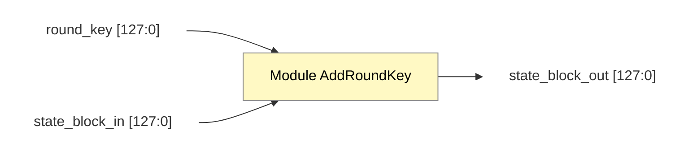

# Module AddRoundKey Design

**Liên kết:** [[AddRoundKey().md|Tài liệu thuật toán]] | [[KeyExpansion_Design|Thiết kế KeyExpansion]]

## 1. Top-Level Block Design (Block Design)

![[Module AddRoundKey high level.png]]

## 2. Mô tả tín hiệu I/O

| Tên Tín hiệu | Hướng | Độ rộng | Mô tả | Liên kết nguồn/đích |
| :--- | :---: | :---: | :--- | :--- |
| `state_block_in` | Input | 128 bit | Trạng thái dữ liệu hiện tại | Từ module `ShiftRows` hoặc `MixColumns` |
| `round_key` | Input | 128 bit | Khóa vòng hiện tại | Từ module `KeyExpansion` |
| `state_block_out` | Output | 128 bit | Trạng thái dữ liệu sau XOR | Chuyển tiếp sang vòng lặp kế tiếp |

## 3. Đặc điểm thiết kế
- **Logic:** Sử dụng 128 cổng XOR song song.
- **Tính chất:** Tổ hợp (Combinational logic), không phụ thuộc xung clock (trừ khi được bao bọc bởi thanh ghi ở module cha).
- **Mối liên hệ:** Tín hiệu `round_key` phải đồng bộ với `round_idx` từ bộ điều khiển trung tâm.

## 4. Low-level Block Design
