# Sơ đồ tổng quát Key Expansion AES

**Liên kết:** [[Key Expansion.md|Tài liệu thuật toán]]

Sơ đồ này mô tả chi tiết quá trình tạo ra 4 Word mới trong một vòng (round) từ các Word của vòng trước.

```mermaid
---
config:
  theme: default
  look: handDrawn
---
flowchart LR
    subgraph Prev_Round [Vòng trước: i-1]
        direction TB
        W0["W[4i-4]"]
        W1["W[4i-3]"]
        W2["W[4i-2]"]
        W3["W[4i-1]"]
    end

    subgraph G_Func [Hàm G: Biến đổi phi tuyến]
        direction TB
        Rot[RotWord] --> Sub[SubWord]
        Sub --> Rcon[XOR Rcon]
    end

    subgraph Xor_Logic [Logic XOR]
        direction TB
        X0((XOR))
        X1((XOR))
        X2((XOR))
        X3((XOR))
    end

    subgraph Curr_Round [Vòng hiện tại: i]
        direction TB
        Wnew0["W[4i]"]
        Wnew1["W[4i+1]"]
        Wnew2["W[4i+2]"]
        Wnew3["W[4i+3]"]
    end

    %% Dòng chảy dữ liệu
    W3 --> G_Func
    G_Func --> X0
    W0 --> X0
    X0 --> Wnew0

    Wnew0 --> X1
    W1 --> X1
    X1 --> Wnew1

    Wnew1 --> X2
    W2 --> X2
    X2 --> Wnew2

    Wnew2 --> X3
    W3 --> X3
    X3 --> Wnew3

    %% Styling
    classDef word fill:none,stroke:#888,stroke-width:2px;
    classDef logic fill:#1a3a5a,stroke:#4682b4,stroke-width:2px;
    classDef gbox fill:#2e2e2e,stroke:#db7093,stroke-width:2px,stroke-dasharray: 5 5;

    class W0,W1,W2,W3,Wnew0,Wnew1,Wnew2,Wnew3 word;
    class X0,X1,X2,X3 logic;
    class G_Func gbox;
```

