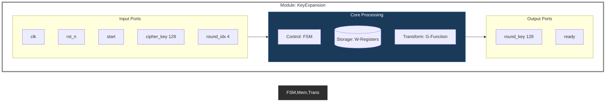

# Module KeyExpansion Top Design

**Liên kết:** [[Key Expansion.md|Tài liệu thuật toán]] | [[RotWord_Design.md|Thiết kế RotWord]] | [[SubWord_Design.md|Thiết kế SubWord]] | [[Rcon_Design.md|Thiết kế Rcon]]

## 1. Chức năng
Module quản lý toàn bộ quá trình mở rộng khóa (AES-128).

## 2. Top-level Block Design (Adaptive)

## 3. Mô tả tín hiệu
| Tín hiệu | Hướng | Độ rộng | Mô tả |
| :--- | :--- | :--- | :--- |
| `clk` | Input | 1 bit | Xung clock |
| `rst_n` | Input | 1 bit | Reset (tích cực thấp) |
| `start` | Input | 1 bit | Lệnh bắt đầu tính toán |
| `cipher_key` | Input | 128 bit | Khóa gốc ban đầu |
| `round_idx` | Input | 4 bit | Chỉ số vòng (0-10) |
| `round_key` | Output | 128 bit | Khóa vòng tương ứng với `round_idx` |
| `ready` | Output | 1 bit | Báo hiệu hoàn tất quá trình mở rộng |

## 4. Mô tả vận hành (Tuân thủ Key Expansion.md)
1. **Khởi tạo:** Nạp `cipher_key` vào `W[0...3]`.
2. **Chu kỳ mở rộng:** 
    - Nếu `i % 4 == 0`: `temp = SubWord(RotWord(W[i-1])) XOR Rcon`.
    - Ngược lại: `temp = W[i-1]`.
    - `W[i] = W[i-4] XOR temp`.
3. **Trích xuất:** Xuất `round_key` dựa trên `round_idx`.
