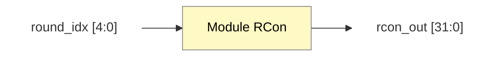

# Module Rcon Design

**Liên kết:** [[Key Expansion.md|Tài liệu thuật toán]] | [[KeyExpansion_Top_Design.md|Thiết kế Top Level]]

## 1. Chức năng
Module `Rcon` (Round Constant) cung cấp một từ 32-bit hằng số cho mỗi vòng lặp. 
Định dạng: `Rcon[i] = [RC[i], 8'h00, 8'h00, 8'h00]`.

## 2. Top-level Block Design (Adaptive)

![[Module RCon high level.png]]
## 3. Mô tả tín hiệu
| Tín hiệu | Hướng | Độ rộng | Mô tả |
| :--- | :--- | :--- | :--- |
| `round_idx` | Input | 4 bit | Chỉ số vòng lặp (1-10 cho AES-128) |
| `rcon_out` | Output | 32 bit | Giá trị hằng số vòng tương ứng |

## 4. Bảng giá trị RC (Hex)
| round_idx | RC [i] | Rcon [i] |
| :--- | :--- | :--- |
| 1 | 01 | 01000000 |
| 2 | 02 | 02000000 |
| 3 | 04 | 04000000 |
| 4 | 08 | 08000000 |
| 5 | 10 | 10000000 |
| 6 | 20 | 20000000 |
| 7 | 40 | 40000000 |
| 8 | 80 | 80000000 |
| 9 | 1B | 1B000000 |
| 10 | 36 | 36000000 |
