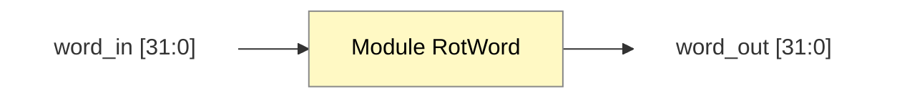

# Module RotWord Design

**Liên kết:** [[Key Expansion.md|Tài liệu thuật toán]] | [[KeyExpansion_Top_Design.md|Thiết kế Top Level]]

## 1. Chức năng
Module thực hiện phép dịch vòng trái 1 byte: `[a0, a1, a2, a3] -> [a1, a2, a3, a0]`.

## 2. Top-level Block Design (Adaptive)

![[Module RotWord high level.png]]
## 3. Mô tả tín hiệu
| Tín hiệu | Hướng | Độ rộng | Mô tả |
| :--- | :--- | :--- | :--- |
| `word_in` | Input | 32 bit | Từ 32-bit đầu vào |
| `word_out` | Output | 32 bit | Từ 32-bit sau dịch trái |
