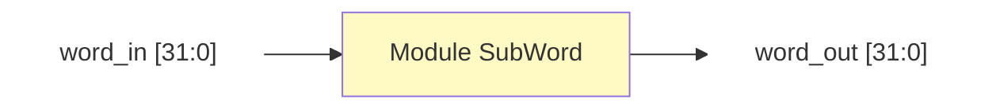

# Module SubWord Design

**Liên kết:** [[Key Expansion.md|Tài liệu thuật toán]] | [[Inverted Key Expansion.md|Tài liệu thuật toán đảo]] | [[KeyExpansion_Design|Thiết kế Top Level]]

## 1. Chức năng
Module thực hiện thay thế byte phi tuyến tính: `SBox(byte)`.

## 2. Top-level Block Design

![[Module SubWord high level.png]]
## 3. Mô tả tín hiệu
| Tín hiệu   | Hướng  | Độ rộng | Mô tả                  |
| :--------- | :----- | :------ | :--------------------- |
| `word_in`  | Input  | 32 bit  | Từ 32-bit đầu vào      |
| `word_out` | Output | 32 bit  | Từ 32-bit sau thay thế |
## 4. Low-level Block Design
